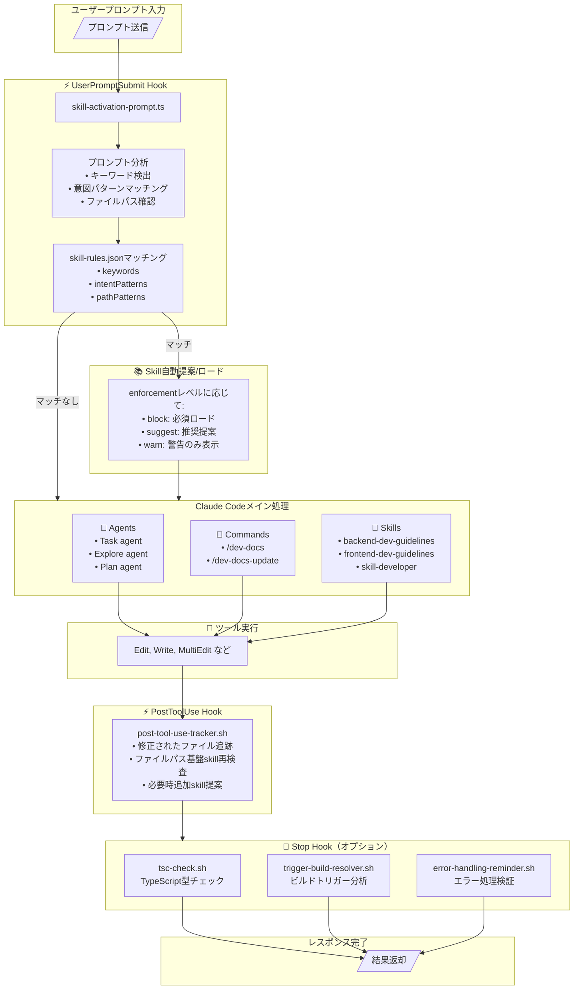
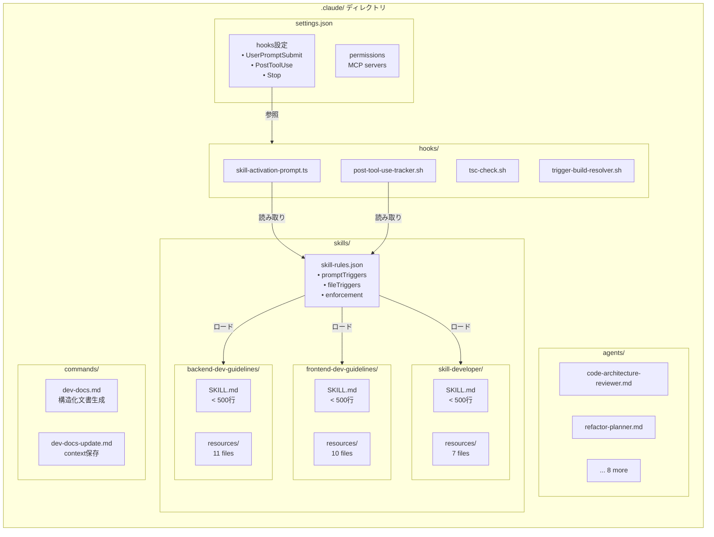
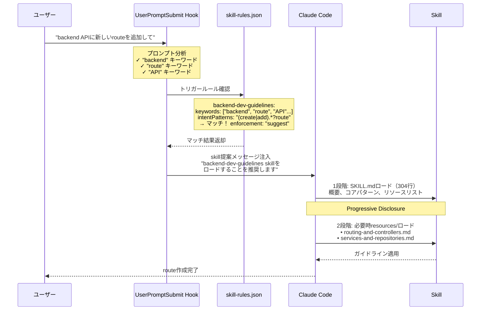

# Claude Code Infrastructure Showcase

🌐 **[English](https://github.com/diet103/claude-code-infrastructure-showcase)** | **[한국어](https://github.com/jung-geun/claude-code-infrastructure-showcase)**

**本番環境で検証済みのClaude Code infrastructureのリファレンスライブラリです。**

複雑なTypeScript microservicesプロジェクトを6ヶ月間実際に運用して得た経験を基に、このshowcaseは「skillsが自動的にアクティベートされない」問題を解決し、Claude Codeをenterprise開発に合わせて拡張したパターンとシステムを提供します。

> 訳者注：このリポジトリは、原著者がRedditに投稿した記事["Claude Code is a Beast – Tips from 6 Months of Hardcore Use"](https://www.reddit.com/r/ClaudeAI/comments/1oivjvm/claude_code_is_a_beast_tips_from_6_months_of/)を読んだ人々から数百件のリクエストを受けた後、コミュニティがこれらのパターンを実装できるように作成されました。まだ該当の投稿を読んでいない場合は、先に投稿を読むことをお勧めします。

> **これは動作するアプリケーションではありません** - リファレンスライブラリの日本語翻訳版です。パフォーマンスとトークン節約のために、[原本リポジトリ](https://github.com/diet103/claude-code-infrastructure-showcase)から必要な部分を自分のプロジェクトにコピーした後、[.claude/skills/skill-rules.json](.claude/skills/skill-rules.json)のキーワードに日本語を追加して使用してください。

---

## 含まれる内容

**本番環境で検証済みのinfrastructure：**
- ✅ **自動アクティベーションskills**（hooks使用）
- ✅ **モジュラーskillパターン**（progressive disclosureを活用した500行ルール）
- ✅ **複雑なタスクのための専門agents**
- ✅ **contextリセットでも生き残るdev docsシステム**
- ✅ **汎用ブログドメインを使用した包括的な例**

**構築に投資した時間：** 6ヶ月の反復開発
**プロジェクトに統合するのにかかる時間：** 15-30分

---

## クイックスタート - パスを選択

### 🤖 Claude Codeを使用して統合しますか？

**Claude：** AI支援セットアップのためのステップバイステップ統合ガイドは[`CLAUDE_INTEGRATION_GUIDE.md`](CLAUDE_INTEGRATION_GUIDE.md)をお読みください。

### 🎯 skill自動アクティベーションが必要です

**コア機能：** 本当に必要な時に自動的にアクティベートされるskills。

**必要なもの：**
1. skill-activation hooks（ファイル2つ）
2. タスクに関連するskill 1〜2個
3. 15分

**👉 [設定ガイド：.claude/hooks/README.md](.claude/hooks/README.md)**

### 📚 skillを1つだけ追加したい

[skills catalog](.claude/skills/)を閲覧して必要なものをコピーしてください。

**利用可能なskills：**
- **backend-dev-guidelines** - Node.js/Express/TypeScriptパターン
- **frontend-dev-guidelines** - React/TypeScript/MUI v7パターン
- **skill-developer** - skill作成のためのMeta-skill
- **route-tester** - 認証されたAPI routeテスト
- **error-tracking** - Sentry統合パターン

**👉 [Skillsガイド：.claude/skills/README.md](.claude/skills/README.md)**

### 🤖 専門agentsが必要です

複雑なタスクのための本番検証済みの10個のagents：
- Code architectureレビュー
- Refactoringサポート
- Documentation生成
- Errorデバッグ
- その他多数...

**👉 [Agentsガイド：.claude/agents/README.md](.claude/agents/README.md)**

---

## 何が違うのですか？

### 自動アクティベーション革新

**問題：** Claude Code skillsはただそこにあるだけです。使用するには覚えておく必要があります。

**解決策：** UserPromptSubmit hookが：
- プロンプトを分析し
- ファイルcontextを確認し
- 関連skillsを自動的に提案し
- `skill-rules.json`設定を通じて動作します

**結果：** Skillsは覚えている時ではなく、必要な時にアクティベートされます。

### 本番環境で検証済みのパターン

これらは理論的な例ではありません - 以下から抽出された実際のパターンです：
- ✅ 本番環境の6つのmicroservices
- ✅ 50,000行以上のTypeScriptコード
- ✅ 複雑なdata gridを持つReact frontend
- ✅ 精巧なworkflow engine
- ✅ 6ヶ月間毎日使用したClaude Code

これらのパターンが動作する理由は、実際の問題を解決したからです。

### モジュラーSkills（500行ルール）

大きなskillsはcontext制限に引っかかります。解決策：

```
skill-name/
  SKILL.md                  # <500行、上位レベルガイド
  resources/
    topic-1.md              # それぞれ<500行
    topic-2.md
    topic-3.md
```

**Progressive disclosure：** Claudeが最初にメインskillをロードし、必要な時だけリソースをロードします。

---

## Repository構造

```
.claude/
├── skills/                 # 本番skills 5つ
│   ├── backend-dev-guidelines/  (リソースファイル12個)
│   ├── frontend-dev-guidelines/ (リソースファイル11個)
│   ├── skill-developer/         (リソースファイル7個)
│   ├── route-tester/
│   ├── error-tracking/
│   └── skill-rules.json    # Skillアクティベーション設定
├── hooks/                  # 自動化のためのhooks 6つ
│   ├── skill-activation-prompt.*  (必須)
│   ├── post-tool-use-tracker.sh   (必須)
│   ├── tsc-check.sh        (オプション、カスタマイズ必要)
│   └── trigger-build-resolver.sh  (オプション)
├── agents/                 # 専門agents 10個
│   ├── code-architecture-reviewer.md
│   ├── refactor-planner.md
│   ├── frontend-error-fixer.md
│   └── ... 7つ以上
└── commands/               # slash commands 3つ
    ├── dev-docs.md
    └── ...

dev/
└── active/                 # Dev docsパターン例
    └── public-infrastructure-repo/
```

---

## コンポーネントカタログ

### 🎨 Skills（5つ）

| Skill | 行数 | 目的 | 最適な使用場所 |
|-------|------|------|----------------|
| [**skill-developer**](.claude/skills/skill-developer/) | 426 | skills作成と管理 | Meta-開発 |
| [**backend-dev-guidelines**](.claude/skills/backend-dev-guidelines/) | 304 | Express/Prisma/Sentryパターン | Backend APIs |
| [**frontend-dev-guidelines**](.claude/skills/frontend-dev-guidelines/) | 398 | React/MUI v7/TypeScript | React frontends |
| [**route-tester**](.claude/skills/route-tester/) | 389 | 認証されたroutesテスト | APIテスト |
| [**error-tracking**](.claude/skills/error-tracking/) | ~250 | Sentry統合 | Errorモニタリング |

**すべてのskillsはモジュラーパターンに従います** - メインファイル + progressive disclosureのためのリソースファイル。

**👉 [skills統合方法 →](.claude/skills/README.md)**

### 🪝 Hooks（6つ）

| Hook | タイプ | 必須？ | カスタマイズ |
|------|--------|--------|--------------|
| skill-activation-prompt | UserPromptSubmit | ✅ 必須 | ✅ 不要 |
| post-tool-use-tracker | PostToolUse | ✅ 必須 | ✅ 不要 |
| tsc-check | Stop | ⚠️ オプション | ⚠️ 重い - monorepo専用 |
| trigger-build-resolver | Stop | ⚠️ オプション | ⚠️ 重い - monorepo専用 |
| error-handling-reminder | Stop | ⚠️ オプション | ⚠️ 普通 |
| stop-build-check-enhanced | Stop | ⚠️ オプション | ⚠️ 普通 |

**必須hooks 2つから始めてください** - skill自動アクティベーションを可能にし、すぐに使用できます。

**👉 [Hook設定ガイド →](.claude/hooks/README.md)**

### 🤖 Agents（10個）

**スタンドアロン - コピーしてすぐ使用！**

| Agent | 目的 |
|-------|------|
| code-architecture-reviewer | アーキテクチャ一貫性のためのコードレビュー |
| code-refactor-master | Refactoring計画と実行 |
| documentation-architect | 包括的なdocumentation生成 |
| frontend-error-fixer | Frontendエラーデバッグ |
| plan-reviewer | 開発計画レビュー |
| refactor-planner | Refactoring戦略策定 |
| web-research-specialist | オンライン技術問題リサーチ |
| auth-route-tester | 認証されたendpointsテスト |
| auth-route-debugger | Auth問題デバッグ |
| auto-error-resolver | TypeScriptエラー自動修正 |

**👉 [Agents動作方法 →](.claude/agents/README.md)**

### 💬 Slash Commands（3つ）

| Command | 目的 |
|---------|------|
| /dev-docs | 構造化されたdev documentation生成 |
| /dev-docs-update | contextリセット前に文書更新 |
| /route-research-for-testing | テストのためのrouteパターンリサーチ |

---

## アーキテクチャ概要

このinfrastructureがClaude Codeの基本パイプラインとどのように統合されるかを示すダイアグラムです。

> 💡 Claude Code内部アーキテクチャの詳細な分析は[Claude Code Deep Dive](https://roboco.io/posts/claude-code-deep-dive/)を参照してください。

### 全体フロー図



### コンポーネント接続関係



### Skillアクティベーション詳細フロー



---

## コア概念

### Hooks + skill-rules.json = 自動アクティベーション

**システム：**
1. **skill-activation-prompt hook**がすべてのユーザープロンプトで実行される
2. **skill-rules.json**でトリガーパターンを確認
3. 関連skillsを自動的に提案
4. Skillsは必要な時だけロードされる

**これはClaude Code skillsの最大の問題を解決します**：自らアクティベートされないという点。

### Progressive Disclosure（500行ルール）

**問題：** 大きなskillsはcontext制限に引っかかります

**解決策：** モジュラー構造
- メインSKILL.md <500行（概要 + ナビゲーション）
- リソースファイルそれぞれ<500行（深い内容）
- Claudeが必要に応じて段階的にロード

**例：** backend-dev-guidelinesはrouting、controllers、services、repositories、testingなどをカバーする12個のリソースファイルを持っています。

### Dev Docsパターン

**問題：** Contextリセットがプロジェクトcontextを失います

**解決策：** 3ファイル構造
- `[task]-plan.md` - 戦略的計画
- `[task]-context.md` - 主要な決定事項とファイル
- `[task]-tasks.md` - チェックリスト形式

**連携：** `/dev-docs` slash commandでこれらを自動生成

---

## ⚠️ 重要：そのままでは動作しないもの

### settings.json
含まれている`settings.json`は**例にすぎません**：
- Stop hooksは特定のmonorepo構造を参照します
- サービス名（blog-apiなど）は例です
- MCP serversがあなたの設定に存在しない可能性があります

**使用するには：**
1. UserPromptSubmitとPostToolUse hooksだけを抽出してください
2. Stop hooksはカスタマイズするかスキップしてください
3. あなたの設定に合わせてMCP serverリストを更新してください

### ブログドメイン例
Skillsは汎用ブログ例を使用します（Post/Comment/User）：
- これらは**学習用の例**であり要件ではありません
- パターンはあらゆるドメイン（e-commerce、SaaSなど）で動作します
- パターンをあなたのビジネスロジックに合わせて調整してください

### Hookディレクトリ構造
一部のhooksは特定の構造を期待します：
- `tsc-check.sh`はserviceディレクトリを期待します
- あなたのプロジェクトレイアウトに合わせてカスタマイズしてください

---

## 統合ワークフロー

**推奨アプローチ：**

### Phase 1：Skillアクティベーション（15分）
1. skill-activation-prompt hookをコピー
2. post-tool-use-tracker hookをコピー
3. settings.jsonを更新
4. hook dependenciesをインストール

### Phase 2：最初のSkill追加（10分）
1. 関連のあるskillを1つ選択
2. skillディレクトリをコピー
3. skill-rules.jsonを作成/更新
4. pathパターンをカスタマイズ

### Phase 3：テスト＆反復（5分）
1. ファイル編集 - skillがアクティベートされるべき
2. 質問する - skillが提案されるべき
3. 必要に応じてより多くのskillsを追加

### Phase 4：オプションの改善
- 有用なagentsを追加
- Slash commandsを追加
- Stop hooksをカスタマイズ（上級）

---

## ヘルプを得る

### ユーザー向け
**統合に問題がありますか？**
1. [CLAUDE_INTEGRATION_GUIDE.md](CLAUDE_INTEGRATION_GUIDE.md)を確認してください
2. Claudeに聞いてください：「なぜ[skill]がアクティベートされないのですか？」
3. プロジェクト構造と一緒にissueを登録してください

### Claude Code向け
ユーザーの統合を助ける時：
1. **まずCLAUDE_INTEGRATION_GUIDE.mdを読んでください**
2. プロジェクト構造について質問してください
3. むやみにコピーせずカスタマイズしてください
4. 統合後に検証してください

---

## 解決する問題

### このInfrastructure以前

❌ Skillsが自動的にアクティベートされません
❌ どのskillを使うか覚えておく必要があります
❌ 大きなskillsがcontext制限に引っかかります
❌ Contextリセットがプロジェクト知識を失います
❌ 開発全般に一貫性がありません
❌ 毎回手動でagentを呼び出す必要があります

### このInfrastructure以後

✅ Skillsがcontextに基づいて自ら提案します
✅ Hooksが適切なタイミングでskillsをトリガーします
✅ モジュラーskillsがcontext制限内に留まります
✅ Dev docsがリセット間で知識を保存します
✅ Guardrailsを通じた一貫したパターンを提供します
✅ Agentsが複雑なタスクを簡素化します

---

## コミュニティ

**役に立ちましたか？**

- ⭐ このrepoにStarを押してください
- 🐛 issueを報告したり改善を提案してください
- 💬 あなた自身のskills/hooks/agentsを共有してください
- 📝 あなたのドメインからの例を貢献してください

**背景：**
このinfrastructureは私がRedditに投稿した記事["Claude Code is a Beast – Tips from 6 Months of Hardcore Use"](https://www.reddit.com/r/ClaudeAI/comments/1oivjvm/claude_code_is_a_beast_tips_from_6_months_of/)で詳しく説明されています。数百件のリクエストを受けた後、コミュニティがこれらのパターンを実装できるようにこのshowcaseが作成されました。

---

## 原文要約（Reddit Post Summary）

**["Claude Code is a Beast – Tips from 6 Months of Hardcore Use"](https://www.reddit.com/r/ClaudeAI/comments/1oivjvm/claude_code_is_a_beast_tips_from_6_months_of/)** 原文の核心内容です。

### プロジェクト背景
- 著者は6ヶ月間**一人で30万行のコードを書き直す**大規模プロジェクトを実施
- Claude Codeをprimary開発ツールとして使用しながらパターンを発展させた

### 核心Tips 1：Skillsシステム
- **`skill-rules.json`** ファイルでトリガーパターン定義
- ファイルパス、キーワード、意図パターンに基づく**自動アクティベーション**実装
- 結果：**40-60%トークン効率向上**

### 核心Tips 2：Hooks基盤自動化
- **TypeScript hookシステム**でskillアクティベーション自動化
- `UserPromptSubmit`と`PostToolUse` hooksが核心
- 手動skill呼び出しを排除してワークフローを簡素化

### 核心Tips 3：Dev Docsパターン
- **`CLAUDE.md`** ファイルでプロジェクト動作方式を管理
- Contextリセットでも生き残る知識保存システム
- 3ファイル構造：`[task]-plan.md`、`[task]-context.md`、`[task]-tasks.md`

### 核心Tips 4：500行ルールとProgressive Disclosure
- 各skillファイルを**500行未満**に維持
- リソースファイルに分割して**段階的ローディング**実装
- Context制限内で効率的な情報伝達

### 核心Tips 5：サブエージェント活用
- 複雑なタスクに**専門agents**を活用
- コードレビュー、refactoring、documentationなど特化した役割
- タスク完了後**コードレビューエージェント**で品質検証

### 追加Tips
- **PM2基盤error monitoring**：サーバーエラーログを自動収集してClaudeに伝達
- **小さな単位のコミット**：変更を小さく維持してrollbackを容易に
- **明確な指示**：曖昧さなく具体的に要求すればより良い結果

> 💡 **核心メッセージ**：Claude Codeの真の力はツール自体ではなく**体系的なinfrastructure構築**にあります。

---

## ライセンス

MIT License - 商業的または個人的プロジェクトで自由に使用してください。

---

## クイックリンク

- 📖 [Claude Integration Guide](CLAUDE_INTEGRATION_GUIDE.md) - AI支援セットアップ用
- 🎨 [Skills Documentation](.claude/skills/README.md)
- 🪝 [Hooks Setup](.claude/hooks/README.md)
- 🤖 [Agents Guide](.claude/agents/README.md)
- 📝 [Dev Docs Pattern](dev/README.md)

**ここから始めてください：** 必須hooks 2つをコピーし、skill 1つを追加して、自動アクティベーションの魔法を体験してください。
